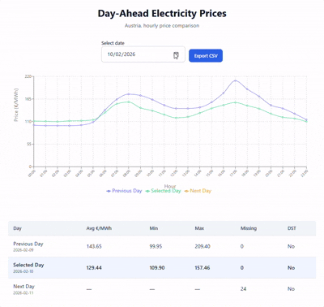

# Electricity-Prices-App- Austria

A full-stack application for visualizing day-ahead electricity prices in Austria using EPEX Spot market data from the aWATTar API.




## Overview

This tool retrieves, processes, and visualizes hourly electricity prices for Austria, showing data for a selected date along with the previous and following days. The application handles data normalization, timezone conversions, and daylight saving time transitions correctly.

## Features

- **Interactive Date Selection**: Choose any date to view electricity prices
- **Multi-Day Comparison**: Visualize three days simultaneously (previous, selected, and next day)
- **Comprehensive Statistics**: View average, minimum, and maximum prices per day
- **Data Export**: Export price data to CSV format
- **Data Completeness Tracking**: Identify missing data points explicitly
- **DST Awareness**: Correctly handles 23-hour and 25-hour days during daylight saving time transitions
- **Negative Price Support**: Properly displays negative electricity prices when they occur

## Tech Stack

### Backend
- **Python** with **UV** package manager
- **FastAPI** - Modern, fast web framework
- **Uvicorn** - ASGI server
- **httpx** - Async HTTP client for API calls
- **ZoneInfo** - Timezone handling

### Frontend
- **React** - UI library
- **Vite** - Build tool and dev server
- **Tailwind CSS** - Utility-first styling
- **Recharts** - Data visualization

### Infrastructure
- **Docker** - Containerization
- **Docker Compose** - Multi-container orchestration

## Quick Start

### Prerequisites

- Docker and Docker Compose installed on your system
- No other services running on ports 3000 and 8000

### Running the Application

1. **Clone the repository** (or extract the project files)
   ```bash
   cd electricity-prices-app
   ```

2. **Start the application**
   ```bash
   docker-compose up --build
   ```

3. **Access the application**
   - Frontend: http://localhost:3000/
   - Backend API: http://localhost:8000/
   - API Documentation: http://localhost:8000/docs

4. **Stop the application**
   ```bash
   docker-compose down
   ```

## API Documentation

### Get Market Data

Retrieves day-ahead electricity prices for a selected date and surrounding days.

**Endpoint:** `GET /api/prices/{date}`

**Query Parameters:**
- `date` (required): Date in ISO format (YYYY-MM-DD)

**Example Request:**
```bash
curl "http://localhost:8000/api/prices/2025-11-26"
```

**Example Response:**
```json
    {
      "previous_day": {
        "date": "2025-11-17",
        "hours": [
          {
            "hour_label": "02:00A",
            "is_dst_transition": false,
            "is_missing": false,
            "price_ct_kwh": 8.55,
            "price_eur_mwh": 85.5,
            "timestamp_ms": 1761433200000
          }
        ],
        "total_hours": 0,
        "missing_hours": 0
      },
      "selected_day": {
        "date": "2025-11-18",
        "hours": [
          {
            "hour_label": "02:00A",
            "is_dst_transition": false,
            "is_missing": false,
            "price_ct_kwh": 8.55,
            "price_eur_mwh": 85.5,
            "timestamp_ms": 1761433200000
          }
        ],
        "total_hours": 0,
        "missing_hours": 0
      },
      "next_day": {
        "date": "2025-11-19",
        "hours": [
          {
            "hour_label": "02:00A",
            "is_dst_transition": false,
            "is_missing": false,
            "price_ct_kwh": 8.55,
            "price_eur_mwh": 85.5,
            "timestamp_ms": 1761433200000
          }
        ],
        "total_hours": 0,
        "missing_hours": 0
      },
      "metadata": {
        "additionalProp1": {}
      }
    }
```

### Export to CSV

Exports price data for three days in CSV format.

**Endpoint:** `GET /api/export/{date}/export-csv`

**Query Parameters:**
- `date` (required): Date in ISO format (YYYY-MM-DD)

**Example Request:**
```bash
curl "http://localhost:8000/api/prices/2025-02-02/export-csv"
```

## Key Features & Implementation

### Data Normalization

The application ensures data completeness through:
- **Hourly Grid Creation**: Generates a complete 24-hour grid for each day
- **Gap Detection**: Missing hours are explicitly marked as `null`
- **DST Handling**: Correctly processes 23-hour (spring) and 25-hour (fall) days
- **Timezone Consistency**: All times are normalized to Europe/Vienna timezone

### Price Visualization

- **Multi-line Chart**: Three colored lines representing previous, selected, and next day
- **Hourly Granularity**: X-axis shows hours from 00:00 to 23:00
- **Unit Display**: Prices shown in €/MWh
- **Negative Price Support**: Chart scales appropriately for negative values
- **Responsive Design**: Adapts to different screen sizes

### Statistics Calculation

For each day, the application computes:
- **Average Price**: Mean of all available hourly prices
- **Minimum Price**: Lowest price in the day
- **Maximum Price**: Highest price in the day
- **Missing Data Count**: Number of hours without data

### Data Export

CSV export includes:
- Date and hour columns
- Price values for all three days
- Headers for easy identification
- Proper handling of missing values

